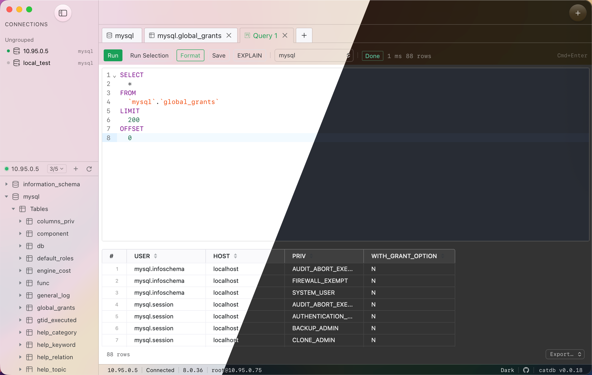

# CatDB

**English** | [简体中文](README.zh-CN.md)

> A cross-platform desktop database management tool.

Currently supports **MySQL**, **PostgreSQL**, **SQLite** and **DM (Dameng)**; more databases are added through compile-time registered driver plugins.


<p align="center">
  
</p>

## 📸 Screenshots

<p align="center">
  
</p>

---

## ✨ Features

- **Connection management**: create / edit / group / test / persist MySQL / PostgreSQL / SQLite connections; passwords live in the OS keyring and are never written to disk in plaintext; SSL and SSH tunnels supported.
- **SQL editor** (CodeMirror 6):
  - Per-dialect keyword highlighting and uppercase completion
  - Metadata-driven database / table / column completion (including cross-database `db.table.col`)
  - Built-in function completion per dialect (aggregate / string / numeric / date / JSON…)
  - 12 common statement snippets (select / selectw / insert / update / delete / join / leftjoin / groupby / orderby / createtable / case / count)
  - Bracket matching, auto-close, indentation, search (Cmd/Ctrl+F), multi-cursor
  - Built-in **schema dropdown** in the editor toolbar: unqualified SQL runs against the selected database
- **Multi-tab query workspace**: independent tab list per connection; Cmd/Ctrl+Enter to run; Run Selection; EXPLAIN; cancel running queries (full `context` propagation).
- **Large result sets**: the backend streams batches via `ResultSet.Next(batch)`, the frontend virtual-scrolls; past the preview limit results switch to streaming export (CSV / JSON / SQL / Excel).
- **Inline editing**: safe UPDATE / DELETE keyed on the primary / unique key; tables with no detectable unique key are automatically read-only.
- **Object tree**: lazy-loaded browsing of database → (schema →) tables / views → columns / indexes / foreign keys — the schema level appears for databases that have one (PostgreSQL); view / copy the table DDL.
- **Table structure editor**: visual editing of columns / indexes / foreign keys / table options plus table creation; ALTER / CREATE statements are generated by the backend diff engine (schemadiff + Dialect) with a live preview.
- **Database editor**: create / alter databases with driver-described option forms (charset & collation for MySQL; owner / template / encoding / locale / tablespace for PostgreSQL).
- **Data transfer**: bulk-copy table structure and data across connections / databases, streamed in batches with progress and per-table results; CSV / SQL file import supported.
- **Structure sync**: diff the tables / views of two databases and generate ALTER / CREATE / DROP scripts to execute item by item; destructive statements are unchecked by default and require a native confirmation.
- **Data sync**: streaming merge comparison of row data ordered by primary key (constant memory regardless of table size); differences are applied as parameterized INSERT / UPDATE / DELETE in batched transactions on a dedicated connection; deleting extra target rows is off by default.
- **i18n**: English / Simplified Chinese, switchable at runtime without restart.
- **Auto-update**: update checks based on GitHub Releases.
- **Native desktop feel**: system font stack, 13 px desktop type size, compact density, hairline radii; context menus / app menus / confirmation dialogs use native Wails menus and dialogs instead of simulated HTML overlays.
- **Standalone connection editor window**: creating / editing a connection opens a real child window with General / Advanced / SSL / SSH segments.
- **Light / dark theme** follows the system (`prefers-color-scheme`).

## 🚧 Current scope

✅ implemented ｜ ⬜ out of scope for now (interface reserved / future iteration)

| Scope | Status |
|---|---|
| MySQL | ✅ |
| PostgreSQL | ✅ |
| SQLite | ✅ |
| DM (Dameng) | ✅ |
| Windows + macOS | ✅ |
| Linux (GTK3) | runs, not guaranteed |
| SQL Server / … | ⬜ interface reserved, waiting for plugins |
| Data transfer / structure sync / data sync | ✅ same-driver; cross-driver (heterogeneous) roadmap in [`docs/异构数据库同步与传输方案.md`](docs/异构数据库同步与传输方案.md) |
| Runtime dynamic plugins (go plugin / Goja) | ⬜ not on the roadmap |
| ER diagrams | ⬜ future iteration |
| AG Grid / Monaco | ⬜ locked to TanStack + CodeMirror |

---

## 🛠 Tech stack

| Layer | Choice |
|---|---|
| Backend | Go 1.22+, [Wails v3.0.0-alpha2.106](https://v3.wails.io/) (**version pinned**) |
| Frontend | Vue 3 (`<script setup>` + Composition API) + TypeScript + Vite, Pinia for state |
| UI components | [Naive UI](https://www.naiveui.com/) (TS-first, JS theme system) |
| SQL editor | [CodeMirror 6](https://codemirror.net/) (`@codemirror/lang-sql` + custom completion sources) |
| Result table | [`@tanstack/vue-table`](https://tanstack.com/table) + [`@tanstack/vue-virtual`](https://tanstack.com/virtual) |
| MySQL driver | `github.com/go-sql-driver/mysql` |
| PostgreSQL driver | [`github.com/jackc/pgx/v5`](https://github.com/jackc/pgx) (native + pgxpool) |
| DM (Dameng) driver | [`gitee.com/chunanyong/dm`](https://gitee.com/chunanyong/dm) (official Go driver mirror, pure Go) |
| SQLite driver / local config | [`modernc.org/sqlite`](https://gitlab.com/cznic/sqlite) (pure Go, **no CGO SQLite**) |
| Credential storage | [`github.com/zalando/go-keyring`](https://github.com/zalando/go-keyring) |
| Excel export | [`github.com/xuri/excelize/v2`](https://github.com/qax-os/excelize) |
| SSH tunnel | `golang.org/x/crypto/ssh` |

> Trade-offs and the reasoning behind "why not Monaco / AG Grid / Electron" live in [`ARCHITECTURE.md`](ARCHITECTURE.md).

---

## 🚀 Getting started

### Prerequisites

- Go ≥ 1.22 (the project uses `go 1.25` with syntax compatible down to 1.22)
- Node.js ≥ 22
- [`wails3`](https://v3.wails.io/getting-started/installation/) CLI installed and on PATH
- Optional: [Task](https://taskfile.dev/) (`task` command); integration tests need Docker

### Development

```bash
# hot-reload development
wails3 dev                # or: task dev

# production build (single executable)
wails3 build              # or: task build

# after changing any Service's public method signature,
# regenerate the frontend TS bindings
wails3 generate bindings -ts -names
```

### Tests

```bash
task test                 # Go unit + contract tests (no Docker required)
task test:integration     # integration tests against real MySQL / PostgreSQL via testcontainers (Docker required)

# frontend type-check + build
cd frontend && npm run build
```

### Packaging

```bash
task package              # platform installer (DMG / NSIS / DEB / ...)
```

---

## 📁 Repository layout

```
catdb/
├── main.go                  # Wails app bootstrap; one of the few places allowed to import application directly
├── wailsbridge/             # anti-corruption layer: every Wails v3 API call lives here
│   ├── bridge.go            #   app handle, Emit
│   ├── window.go            #   child-window management (connection editor, etc.)
│   ├── menu.go              #   native application menu
│   ├── dialog.go            #   native file / message dialogs
│   └── close_guard.go       #   unsaved-SQL guard before window close
├── internal/
│   ├── dbdriver/            # unified abstraction (Driver/Connection/Querier/Metadata/Dialect/Editor)
│   │   └── contract/        #   driver contract test suite (every new driver must pass)
│   ├── registry/            # compile-time driver registry
│   ├── core/
│   │   ├── session/         #   connection manager (one pool per connection, dedicated leases for long tasks)
│   │   ├── scanner/         #   generic streaming ResultSet scanner
│   │   ├── schemadiff/      #   driver-agnostic table diff (→ ChangeSet → Dialect renders DDL)
│   │   └── datasync/        #   pk-ordered streaming merge engine for row compare / sync
│   ├── storage/             # SQLite connection-config store + keyring credentials
│   ├── tunnel/              # SSH tunnel
│   ├── platform/            # platform details (e.g. switching macOS input source)
│   └── services/            # Wails Service entry points (thin)
│       ├── connection_service.go
│       ├── query_service.go
│       ├── metadata_service.go
│       ├── edit_service.go
│       ├── transfer_service.go
│       ├── sync_service.go   #  structure sync + data sync
│       └── system_service.go
├── plugins/
│   ├── plugins_all.go       # build-tag-controlled anonymous import aggregation
│   ├── plugins_mysql.go
│   ├── plugins_postgres.go
│   ├── plugins_sqlite.go
│   ├── plugins_dm.go
│   ├── mysqldrv/            # MySQL driver implementation
│   ├── postgresdrv/         # PostgreSQL driver implementation (pgx native, per-database pools)
│   ├── sqlitedrv/           # SQLite driver implementation (modernc.org/sqlite, pure Go)
│   └── dmdrv/               # DM (Dameng) driver implementation (official Go driver, schemas as databases)
└── frontend/
    └── src/
        ├── api/             # frontend anti-corruption layer: wraps bindings + events, components only call api/
        ├── components/      # SqlEditor / QueryTab / ResultTable / ConnectionForm / …
        ├── editor/          # CodeMirror extensions (function & snippet completion sources)
        ├── stores/          # Pinia (connections / query / metadata / theme)
        └── styles/          # Naive UI theme overrides
```

---

## 🧱 Design highlights

- **Load-bearing wall: the `internal/dbdriver` interfaces.** A new driver implements `Driver / Connection / Querier / ResultSet / Metadata / Dialect / Editor`, calls `registry.Register(...)` in its `init()`, and gets an anonymous import in `plugins/plugins_all.go`. See [`ARCHITECTURE.md §3.4`](ARCHITECTURE.md).
- **Wails API isolation.** On the Go side every `application.*` call is confined to `wailsbridge/`; frontend components may only call `frontend/src/api/`. Breaking alpha changes touch exactly one place.
- **`context.Context` end to end.** Every Service method takes `ctx` first; downstream is always `QueryContext/ExecContext`. Cancelling the frontend promise cancels ctx and interrupts the query. Uncancellable blocking queries are **forbidden**.
- **Parameterized SQL.** Table-data UPDATE/DELETE must be keyed on a primary / unique key; tables without one are read-only.
- **Large result sets are never serialized at once.** Batched `ResultSet.Next(batch)`; row data is `[][]any` (not `[]map[string]any`); large exports stream to file without crossing IPC.
- **Multi-window concurrency isolation.** Transactions / exclusive operations get a dedicated connection from the session manager bound to the window ID.
- **Passwords never hit disk in plaintext.** SQLite stores config only; passwords go to the keyring.
- **Native-leaning UI.** See [`DESIGN.md`](DESIGN.md): system font stack, 12–13 px desktop type, compact layout, hairline radii; context menus / app menus / confirmations are native.

---

## 🤝 For Claude Code / contributors

The repository ships [`CLAUDE.md`](CLAUDE.md) — the **mandatory working conventions** for Claude Code in this repo (hard rules + command cheatsheet + directory ownership). Human contributors are encouraged to read it before changing code too:

- Interface semantics, data flow, design trade-offs → [`ARCHITECTURE.md`](ARCHITECTURE.md)
- How UI / interactions should feel "native" → [`DESIGN.md`](DESIGN.md)
- Working conventions (hard rules + commands) → [`CLAUDE.md`](CLAUDE.md)

Make sure `task test` passes before committing; after changing a Service's public methods, run `wails3 generate bindings -ts -names`.

---

## 📦 Platform support

| Platform | Status |
|---|---|
| macOS (Apple Silicon + Intel) | ✅ target platform |
| Windows | ✅ target platform |
| Linux (GTK3, `-tags gtk3`) | 🟡 runs; GTK4 experimental features not guaranteed |
