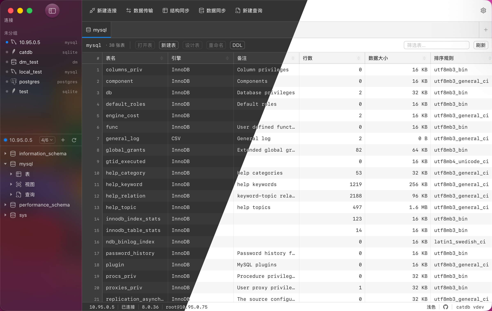

# CatDB

[English](README.md) | **简体中文**

> 一个跨平台的桌面数据库管理工具。

目前支持 **MySQL**、**PostgreSQL**、**SQLite** 与 **达梦（DM）**；其他数据库通过编译期注册的插件接口扩展，逐步跟进。


<p align="center">
  
</p>

## 📸 应用截图

<p align="center">
  
</p>

---

## ✨ 功能特性

- **连接管理**：MySQL / PostgreSQL / SQLite 连接的新建 / 编辑 / 分组 / 测试 / 持久化；密码走 OS keyring，绝不明文落盘；支持 SSL 与 SSH 隧道。
- **SQL 编辑器**（基于 CodeMirror 6）：
  - 按方言的关键字高亮与大写补全
  - 元数据驱动的库 / 表 / 列自动补全（含跨库 `db.table.col` 完成）
  - 按方言内置函数补全（聚合 / 字符串 / 数值 / 日期 / JSON…）
  - 12 个常用语句片段（select / selectw / insert / update / delete / join / leftjoin / groupby / orderby / createtable / case / count）
  - 括号匹配、自动闭合、缩进、查找（Cmd/Ctrl+F）、多光标
  - 编辑器工具栏内置 **Schema 下拉**：SQL 未限定数据库时使用当前选中的库
- **多标签查询工作区**：每个连接独立 tab 列表；Cmd/Ctrl+Enter 运行；Run Selection；EXPLAIN；取消正在执行的查询（带 `context` 全链路传播）。
- **大结果集**：后端分批 `ResultSet.Next(batch)` 流式读取，前端虚拟滚动；超出预览上限自动转为流式导出（CSV / JSON / SQL / Excel）。
- **行内编辑**：基于主键 / 唯一键的安全 UPDATE / DELETE；无可识别唯一键的表自动标记为只读。
- **对象树**：库 →（schema →）表 / 视图 → 列 / 索引 / 外键 的懒加载浏览——有 schema 层级的数据库（PostgreSQL）自动插入该层；查看 / 复制表 DDL。
- **表结构编辑器**：列 / 索引 / 外键 / 表选项的可视化编辑与新建表；ALTER / CREATE 由后端 diff 引擎（schemadiff + Dialect）生成并实时预览。
- **数据库编辑器**：建库 / 改库表单由驱动自描述（MySQL 为字符集 / 排序规则；PostgreSQL 为所有者 / 模板 / 编码 / locale / 表空间）。
- **数据传输**：跨连接 / 跨库整批复制表结构与数据，流式分批 + 进度 + 逐表结果；支持 CSV / SQL 文件导入。
- **结构同步**：比对两个库的表 / 视图 DDL 差异，生成 ALTER / CREATE / DROP 脚本按项勾选执行；破坏性语句默认不勾选且执行前原生确认。
- **数据同步**：按主键排序流式归并比对行数据（内存恒定，不随表大小增长），差异以参数化 INSERT / UPDATE / DELETE 在独立连接上分批事务执行；删除目标端多余行默认关闭。
- **多语言**：English / 简体中文，运行时切换、无需重启。
- **自动更新**：基于 GitHub Releases 的更新检查。
- **原生桌面感**：系统字体栈、13 px 桌面字号、紧凑密度、发丝线圆角；右键 / 菜单 / 确认弹窗走 Wails 原生菜单与对话框，不用网页 div 模拟。
- **独立连接编辑器窗口**：新建 / 编辑连接是真正的子窗口，常规 / 高级 / SSL / SSH 用 Segmented Control 切换。
- **明暗主题**跟随系统（`prefers-color-scheme`）。

## 🚧 当前范围

✅ 实现 ｜ ⬜ 暂不在范围（接口预留 / 后续迭代）

| 范围 | 状态 |
|---|---|
| MySQL | ✅ |
| PostgreSQL | ✅ |
| SQLite | ✅ |
| 达梦（DM） | ✅ |
| Windows + macOS | ✅ |
| Linux (GTK3) | 可跑但不保证 |
| SQL Server / … | ⬜ 接口预留，等插件 |
| 数据传输 / 结构同步 / 数据同步 | ✅ 同构；跨驱动（异构）路线图见 [`docs/异构数据库同步与传输方案.md`](docs/异构数据库同步与传输方案.md) |
| 运行时动态插件 (go plugin / Goja) | ⬜ 主线不做 |
| ER 图 | ⬜ 后续迭代 |
| AG Grid / Monaco | ⬜ 锁定 TanStack + CodeMirror |

---

## 🛠 技术栈

| 层 | 选型 |
|---|---|
| 后端 | Go 1.22+ ， [Wails v3.0.0-alpha2.106](https://v3.wails.io/)（**版本钉死**） |
| 前端 | Vue 3（`<script setup>` + Composition API） + TypeScript + Vite，Pinia 管状态 |
| UI 组件 | [Naive UI](https://www.naiveui.com/)（TS-first，JS 主题系统） |
| SQL 编辑器 | [CodeMirror 6](https://codemirror.net/)（`@codemirror/lang-sql` + 自定义补全源） |
| 结果表格 | [`@tanstack/vue-table`](https://tanstack.com/table) + [`@tanstack/vue-virtual`](https://tanstack.com/virtual) |
| MySQL 驱动 | `github.com/go-sql-driver/mysql` |
| PostgreSQL 驱动 | [`github.com/jackc/pgx/v5`](https://github.com/jackc/pgx)（原生 + pgxpool） |
| 达梦（DM）驱动 | [`gitee.com/chunanyong/dm`](https://gitee.com/chunanyong/dm)（官方 Go 驱动镜像，纯 Go） |
| SQLite 驱动 / 本地配置 | [`modernc.org/sqlite`](https://gitlab.com/cznic/sqlite)（纯 Go，**禁止 CGO SQLite**） |
| 凭据存储 | [`github.com/zalando/go-keyring`](https://github.com/zalando/go-keyring) |
| Excel 导出 | [`github.com/xuri/excelize/v2`](https://github.com/qax-os/excelize) |
| SSH 隧道 | `golang.org/x/crypto/ssh` |

> 选型权衡与"为什么不是 Monaco / AG Grid / Electron"等设计依据见 [`ARCHITECTURE.md`](ARCHITECTURE.md)。

---

## 🚀 快速开始

### 前置

- Go ≥ 1.22（项目使用 `go 1.25`，向下兼容到 1.22 的语法）
- Node.js ≥ 22
- [`wails3`](https://v3.wails.io/getting-started/installation/) CLI 已安装并在 PATH 中
- 可选：[Task](https://taskfile.dev/) (`task` 命令)，集成测试需要 Docker

### 开发

```bash
# 热重载开发
wails3 dev                # 或: task dev

# 生产构建（单可执行文件）
wails3 build              # 或: task build

# 改动 Service 的公共方法签名后，必须重新生成前端 TS 绑定
wails3 generate bindings -ts -names
```

### 测试

```bash
task test                 # Go 单元 + 契约测试（不需要 Docker）
task test:integration     # 用 testcontainers 起真实 MySQL / PostgreSQL 的集成测试（需要 Docker）

# 前端类型检查 + 构建
cd frontend && npm run build
```

### 打包

```bash
task package              # 按当前平台打包安装包（DMG / NSIS / DEB / ...）
```

---

## 📁 目录结构

```
catdb/
├── main.go                  # Wails App 启动；唯一可直接 import application 的位置之一
├── wailsbridge/             # 防腐层：所有 Wails v3 API 调用集中在此
│   ├── bridge.go            #   App 句柄、Emit
│   ├── window.go            #   子窗口管理（连接编辑器等独立窗口）
│   ├── menu.go              #   原生应用菜单
│   ├── dialog.go            #   原生文件 / 信息对话框
│   └── close_guard.go       #   关窗前未保存 SQL 拦截
├── internal/
│   ├── dbdriver/            # 统一抽象接口（Driver/Connection/Querier/Metadata/Dialect/Editor）
│   │   └── contract/        #   驱动契约测试套件（新驱动必须跑过）
│   ├── registry/            # 编译期驱动注册表
│   ├── core/
│   │   ├── session/         #   连接管理器（一连接一池，长任务可租借独立连接）
│   │   ├── scanner/         #   通用 ResultSet 流式扫描器
│   │   ├── schemadiff/      #   驱动无关的表结构 diff（→ ChangeSet → Dialect 渲染 DDL）
│   │   └── datasync/        #   按主键流式归并的行数据比对 / 同步引擎
│   ├── storage/             # SQLite 连接配置存储 + keyring 凭据
│   ├── tunnel/              # SSH 隧道
│   ├── platform/            # 平台细节（macOS 切英文输入法等）
│   └── services/            # Wails Service 入口（薄）
│       ├── connection_service.go
│       ├── query_service.go
│       ├── metadata_service.go
│       ├── edit_service.go
│       ├── transfer_service.go
│       ├── sync_service.go   #  结构同步 + 数据同步
│       └── system_service.go
├── plugins/
│   ├── plugins_all.go       # 通过 build-tag 控制的匿名导入聚合
│   ├── plugins_mysql.go
│   ├── plugins_postgres.go
│   ├── plugins_sqlite.go
│   ├── plugins_dm.go
│   ├── mysqldrv/            # MySQL 驱动实现
│   ├── postgresdrv/         # PostgreSQL 驱动实现（pgx 原生，按库独立连接池）
│   ├── sqlitedrv/           # SQLite 驱动实现（modernc.org/sqlite，纯 Go）
│   └── dmdrv/               # 达梦（DM）驱动实现（官方 Go 驱动，模式映射为数据库层级）
└── frontend/
    └── src/
        ├── api/             # 前端防腐层：封装绑定 + 事件，组件只调 api/
        ├── components/      # SqlEditor / QueryTab / ResultTable / ConnectionForm / …
        ├── editor/          # CodeMirror 扩展（函数与片段补全源）
        ├── stores/          # Pinia（connections / query / metadata / theme）
        └── styles/          # Naive UI 主题覆盖
```

---

## 🧱 设计要点

- **承重墙：`internal/dbdriver` 接口**。新驱动只需要实现 `Driver / Connection / Querier / ResultSet / Metadata / Dialect / Editor` 并在自己包的 `init()` 里 `registry.Register(...)`，再到 `plugins/plugins_all.go` 匿名导入即可。详见 [`ARCHITECTURE.md §3.4`](ARCHITECTURE.md)。
- **Wails API 隔离**。Go 侧所有 `application.*` 调用只允许出现在 `wailsbridge/`；前端组件只准调 `frontend/src/api/`。alpha 版本破坏性改动只需要改一处。
- **全链路 `context.Context`**。所有 Service 方法首参 `ctx`，下游一律 `QueryContext/ExecContext`。前端取消 promise → ctx 取消 → 查询中断。**禁止**写不可取消的阻塞查询。
- **SQL 参数化**。表数据的 UPDATE/DELETE 必须基于主键 / 唯一键；探测不到的表自动只读。
- **大结果集不一次性序列化**。后端分批 `ResultSet.Next(batch)`；行数据用 `[][]any`（非 `[]map[string]any`）；大导出走流式写文件，不经 IPC。
- **多窗口并发隔离**。事务 / 独占操作走会话管理器分离的独立连接并绑定窗口 ID。
- **密码绝不明文落盘**。SQLite 只存配置；密码只进 keyring。
- **UI 原生化**。详见 [`UI_SPEC.md`](UI_SPEC.md)：系统字体栈、12–13 px 桌面字号、紧凑布局、发丝线圆角；右键 / 顶层菜单 / 确认弹窗走原生。

---

## 🤝 给 Claude Code / 贡献者

仓库内置 [`CLAUDE.md`](CLAUDE.md)，是 Claude Code 在本仓库工作的**强制约定**（铁律 + 命令速查 + 目录归属）。任何贡献者改代码前也建议先读它：

- 接口语义、数据流、设计取舍 → [`ARCHITECTURE.md`](ARCHITECTURE.md)
- UI / 交互怎么做才"像原生" → [`UI_SPEC.md`](UI_SPEC.md)
- 工作规约（铁律 + 命令） → [`CLAUDE.md`](CLAUDE.md)

提交前请确保 `task test` 通过；改动 Service 公共方法后记得跑 `wails3 generate bindings -ts -names`。

---

## 📦 平台支持

| 平台 | 状态 |
|---|---|
| macOS (Apple Silicon + Intel) | ✅ 目标平台 |
| Windows | ✅ 目标平台 |
| Linux (GTK3, `-tags gtk3`) | 🟡 可跑，不保证 GTK4 实验特性 |
